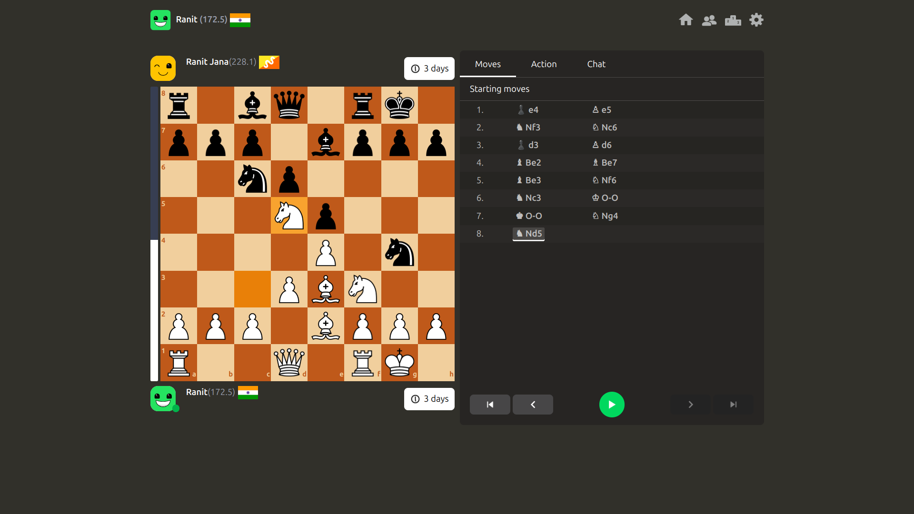

# **♟️ Chess Website**

🚀 **Welcome to my Chess Website!** This is an interactive platform where people can play chess and chat in real time.

## **🖼️ Preview**



## **🌟 Features**

### **♟️ Game Features**

✅ **Play Chess Live** – Challenge friends or random opponents  
✅ **Real-Time Challenge** – Instantly challenge online players  
✅ **Evaluation Bar** – Displays real-time game evaluation  
✅ **Smooth Gameplay** – Fast and responsive moves  
✅ **Game Moves Navigation** – Navigate through previous moves with an auto-play feature  
✅ **Change Board Theme** – Customize the board appearance with different themes

### **💬 Chat Features**

✅ **Live Chat** – Talk to your opponent while playing  
✅ **Reactions & Replies** – React to messages and drag to reply

### **👤 Other Features**

✅ **Scan to Get User Info** – Scan and retrieve player details
✅ **User Accounts** – Track games and history  
✅ **Friends System** – Add and play with friends

## **🥧 Tech Stack**

### **Frontend:**

- React : `react`
- Routing: `react-router-dom`
- State Management: `react-infinite-scroll-component`
- UI Enhancements: `emoji-picker-react`, `react-hot-toast`, `country-flag-icons`
- Chess Logic: `chess.js`
- OAuth: `google`
- WebSockets: `socket`
- Avatar Generation: `dicebear`

### **Backend:**

- Routing: `express`
- Authentication: `jsonwebtoken`, `bcryptjs`
- Database: `mongoose`
- WebSockets: `socket`
- Redis: `ioredis`
- Google API: `googleapis`

## **📌 How to Run the Project**

### **1️⃣ Clone the Repository**

```sh
 git clone https://github.com/RanitJana/Chess.git
 cd Chess
```

### **2️⃣ Run the Project**

You have two options to start the application:

#### **🔹 Manually Start Both Servers**

1. Open two terminals, one for the frontend and one for the backend.
2. Start the backend server:
   ```sh
   cd server
   npm install
   npm start
   ```
3. Start the frontend server:
   ```sh
   cd client
   npm install
   npm run dev
   ```

#### **🔹 Use `start.sh` Script**

1. Ensure you have execution permission:
   ```sh
   chmod +x start.sh
   ```
2. Run the script:
   ```sh
   bash start.sh
   ```

#### **🔹 Run with Docker**

To run the application using Docker, ensure Docker is installed on your local system.

1. Install [Docker](https://www.docker.com/) if not already installed.
2. Ensure ports **5000** and **5173** are free.
3. Build and start the containers using:
   ```sh
   docker compose up
   ```
4. Access the application at `http://localhost:5173`

## **🔮 Future Improvements**

- **React virtualization in chat** - It'll help to render chat content most efficiently
- **Time limit** – Game over when Time limit exceeds.
- **Repeatation draw** – 3 times move repeat to draw.
- **Drag and Drop piece** – Drag pieces and drop.
- **Game Analysis** – Review and analyze past games for improvement.
- **Play with Bot** – Practice against AI opponents.
- **Daily Puzzle** – Solve a new chess puzzle every day.
- **End-to-End Encryption** – Secure communication for chats.

Stay tuned for updates! 🚀♟️
